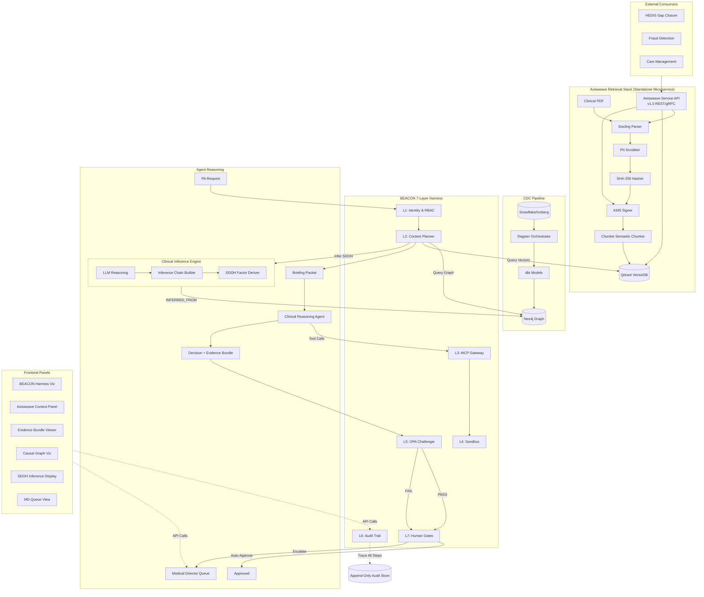
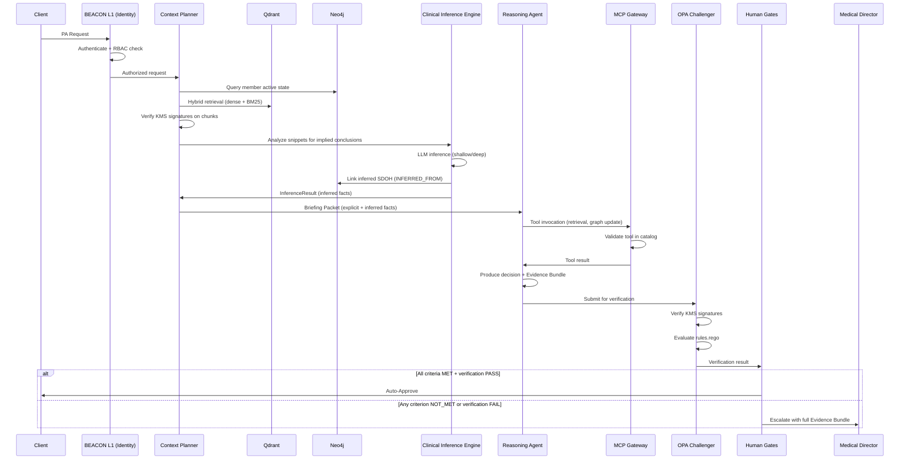
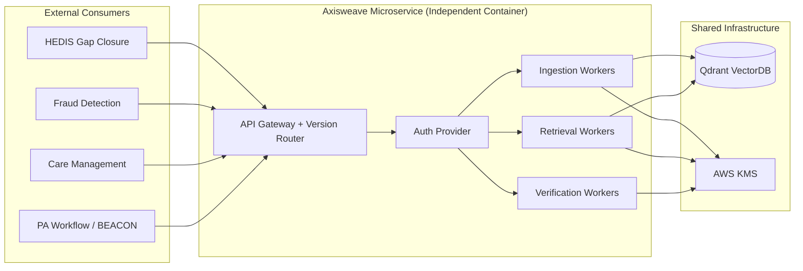
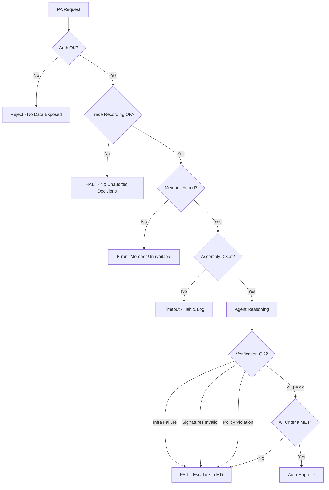

# Design Document: Clinical Reasoning Fabric

## Overview

The Clinical Reasoning Fabric (CRF) is a layered architecture that orchestrates clinical AI agents for Prior Authorization (PA) decision support. It integrates three decoupled subsystems:

1. **Axisweave Retrieval Stack** — Handles document ingestion, PII scrubbing, cryptographic signing, semantic chunking, and hybrid vector+BM25 retrieval via Qdrant.
2. **Causal Ontology Graph** — A Neo4j graph database maintaining active clinical state projected from Snowflake/Iceberg via a dbt+Dagster CDC pipeline.
3. **BEACON 7-Layer Safety Harness** — Wraps all LLM interactions with identity control (L1), context restriction (L2), tool orchestration (L3), sandboxed execution (L4), verification loops (L5), observability (L6), and human gates (L7).

The system produces Evidence Bundles containing decision rationale, cryptographic lineage, and original document signatures. Automated approvals occur only when all criteria are unambiguously met; all other cases escalate to a human Medical Director. **The system never automatically denies a PA request.**

### Key Design Decisions

| Decision | Rationale |
|----------|-----------|
| Qdrant over Pinecone/Weaviate | Native BM25 sparse index support enables true hybrid search without external Elasticsearch dependency |
| Neo4j for causal graph | Cypher query language maps directly to clinical relationship traversals; native APOC procedures support CDC upserts |
| AWS KMS asymmetric signing | Hardware-backed key material prevents key extraction; integrates with existing EKS IAM roles |
| Docling + Chonkie over LangChain | Docling provides superior clinical PDF table extraction; Chonkie's semantic chunking preserves clinical context boundaries |
| OPA for policy verification | Declarative Rego rules enable non-programmer medical directors to audit policy logic; existing rules.rego pattern in codebase |
| dbt + Dagster over Kafka Streams | dbt models are version-controlled and testable; Dagster provides observability without Kafka operational overhead |

## Architecture

### High-Level System Diagram



### Component Interaction Sequence



## Components and Interfaces

### 1. Axisweave Retrieval Stack

#### DocumentIngestionService

```python
class DocumentIngestionService:
    """Orchestrates PDF parsing, PII scrubbing, signing, chunking, and storage."""

    def __init__(self, kms_client: KMSClient, qdrant_client: QdrantClient, 
                 pii_scrubber: PIIScrubber, chunker: ChonkieChunker):
        self.kms = kms_client
        self.qdrant = qdrant_client
        self.pii_scrubber = pii_scrubber
        self.chunker = chunker

    async def ingest_document(self, document_bytes: bytes, document_id: str, 
                              source_metadata: dict) -> IngestionResult:
        """
        Full ingestion pipeline: parse → scrub → hash → sign → chunk → store.
        
        Returns IngestionResult with document_id, content_hash, signature, 
        chunk_count, and ingestion_timestamp.
        Raises IngestionError on any pipeline failure.
        """
        ...

    async def parse_pdf(self, document_bytes: bytes) -> str:
        """Parse PDF using Docling. Returns extracted text."""
        ...

    async def scrub_pii(self, text: str) -> str:
        """Remove all HIPAA Safe Harbor identifiers. Raises PIIScrubError on failure."""
        ...

    async def compute_hash(self, text: str) -> str:
        """Compute SHA-256 hash of cleaned text."""
        ...

    async def sign_hash(self, content_hash: str) -> KMSSignature:
        """Sign content hash with AWS KMS asymmetric key. Raises KMSUnavailableError."""
        ...

    async def chunk_and_store(self, text: str, document_id: str, 
                              content_hash: str, signature: KMSSignature) -> int:
        """Semantic chunk text and store in Qdrant with provenance metadata. Returns chunk count."""
        ...
```

#### HybridRetrievalService

```python
class HybridRetrievalService:
    """Executes hybrid dense+BM25 retrieval with signature verification."""

    def __init__(self, qdrant_client: QdrantClient, kms_client: KMSClient,
                 embedding_model: EmbeddingModel):
        self.qdrant = qdrant_client
        self.kms = kms_client
        self.embedder = embedding_model

    async def retrieve(self, query: str, top_k: int = 20, 
                       min_score: float = 0.5) -> RetrievalResult:
        """
        Execute hybrid retrieval: dense top-50 + BM25 top-50 → RRF → top-k.
        Verify KMS signatures on all results before returning.
        
        Returns RetrievalResult with verified chunks and any tamper alerts.
        """
        ...

    async def dense_search(self, query_embedding: list[float], 
                           top_k: int = 50) -> list[ScoredChunk]:
        """Dense vector cosine similarity search."""
        ...

    async def sparse_search(self, query_terms: list[str], 
                            top_k: int = 50) -> list[ScoredChunk]:
        """BM25 sparse index search."""
        ...

    def reciprocal_rank_fusion(self, dense_results: list[ScoredChunk],
                               sparse_results: list[ScoredChunk],
                               k: int = 60) -> list[ScoredChunk]:
        """
        Combine dense and sparse results using RRF scoring.
        RRF_score(d) = Σ 1/(k + rank_i(d)) for each ranking i where d appears.
        """
        ...

    async def verify_signatures(self, chunks: list[ScoredChunk]) -> tuple[list[ScoredChunk], list[TamperAlert]]:
        """Verify KMS signatures on chunks. Returns (verified, tamper_alerts)."""
        ...
```

### 2. Causal Ontology Graph

#### CausalOntologyGraphService

```python
class CausalOntologyGraphService:
    """Interface for querying and updating the Neo4j causal ontology graph."""

    def __init__(self, neo4j_driver: Neo4jDriver):
        self.driver = neo4j_driver

    async def get_member_active_state(self, member_id: str) -> MemberActiveState:
        """
        Return active clinical state: current diagnoses, active prescriptions,
        linked SDOH factors, and governing policy rules.
        Must complete within 2 seconds.
        """
        ...

    async def upsert_node(self, node_type: str, node_id: str, 
                          properties: dict, execution_id: str = None) -> None:
        """Upsert a graph node with optional agent execution provenance."""
        ...

    async def upsert_relationship(self, source_id: str, target_id: str,
                                  rel_type: str, properties: dict) -> None:
        """Upsert a directed relationship between nodes."""
        ...

    async def query_related_evidence(self, member_id: str, 
                                     condition_code: str) -> list[EvidenceNode]:
        """Query evidence nodes linked to a member's specific condition."""
        ...
```

### 3. CDC Pipeline

#### CDCPipelineService (dbt + Dagster)

```python
class CDCPipelineService:
    """Manages CDC from Snowflake/Iceberg to Neo4j via dbt models and Dagster orchestration."""

    def __init__(self, dagster_client: DagsterClient, neo4j_service: CausalOntologyGraphService):
        self.dagster = dagster_client
        self.graph = neo4j_service

    async def process_change_event(self, event: CDCEvent) -> ProcessingResult:
        """
        Transform and apply a single CDC event to the graph.
        Retries up to 3 times with exponential backoff (5s base).
        """
        ...

    async def transform_to_graph_entity(self, event: CDCEvent) -> GraphEntity:
        """
        Map source record to graph node/relationship type using dbt model definitions.
        Raises UnmappableRecordError for records that cannot be mapped.
        """
        ...

    async def apply_upsert(self, entity: GraphEntity) -> None:
        """Apply upsert to Neo4j without removing unrelated relationships."""
        ...

    def get_checkpoint(self) -> EventCheckpoint:
        """Return the last successfully processed event checkpoint."""
        ...

    def update_checkpoint(self, checkpoint: EventCheckpoint) -> None:
        """Update the event checkpoint after successful processing."""
        ...
```

### 4. BEACON Layer 1 — Identity & Permissions

#### IdentityService

```python
class IdentityService:
    """Handles authentication, RBAC enforcement, and PII/PHI masking."""

    def __init__(self, rbac_policy: RBACPolicy, masking_service: MaskingService):
        self.rbac = rbac_policy
        self.masker = masking_service

    async def authenticate_and_authorize(self, credentials: Credentials, 
                                          operation: str) -> AuthResult:
        """
        Authenticate identity and verify RBAC permissions.
        Returns AuthResult with identity_id and granted permissions.
        Raises UnauthorizedError if identity lacks permissions.
        """
        ...

    def mask_phi(self, data: dict) -> dict:
        """Replace all PII/PHI fields with irreversible masked tokens."""
        ...

    def create_trace_context(self, identity_id: str, request_id: str) -> TraceContext:
        """Create a trace context associating all actions with the authenticated identity."""
        ...
```

### 5. BEACON Layer 2 — Context Planner

#### ContextPlannerService

```python
class ContextPlannerService:
    """Assembles Briefing Packets by querying graph and vector stores."""

    def __init__(self, graph_service: CausalOntologyGraphService,
                 retrieval_service: HybridRetrievalService):
        self.graph = graph_service
        self.retrieval = retrieval_service

    async def assemble_briefing_packet(self, pa_request: PARequest) -> BriefingPacket:
        """
        Assemble a Briefing Packet within 30-second timeout:
        1. Query Neo4j for member active state
        2. Query Qdrant for relevant evidence (max 20 snippets, min score 0.5)
        3. Filter to relevant diagnoses/medications for the CPT code
        4. Package into BriefingPacket schema
        
        Raises MemberNotFoundError, TimeoutError.
        """
        ...
```

### 6. BEACON Layer 3 — MCP Gateway

#### MCPGatewayService

```python
class MCPGatewayService:
    """Controlled tool invocation gateway with catalog validation."""

    def __init__(self, tool_catalog: ToolCatalog, sandbox: SandboxExecutor):
        self.catalog = tool_catalog
        self.sandbox = sandbox

    async def invoke_tool(self, tool_name: str, parameters: dict, 
                          agent_identity: str) -> ToolResult:
        """
        Validate tool is in catalog, parameters match schema, execute in sandbox.
        Records invocation in execution trace.
        Default timeout: 30 seconds per tool.
        """
        ...

    def validate_tool_request(self, tool_name: str, parameters: dict) -> bool:
        """Check tool exists in catalog and parameters conform to schema."""
        ...
```

### 7. BEACON Layer 5 — OPA Challenger Agent

#### OPAChallengerService

```python
class OPAChallengerService:
    """Independent verification agent for signature and policy compliance."""

    def __init__(self, kms_client: KMSClient, opa_evaluator: OPAEvaluator):
        self.kms = kms_client
        self.opa = opa_evaluator

    async def verify_decision(self, evidence_bundle: EvidenceBundle) -> VerificationResult:
        """
        1. Verify KMS signatures on all referenced evidence (within 30s)
        2. Evaluate decision against OPA rules.rego (within 10s)
        3. Return PASS/FAIL with findings
        
        On any infrastructure failure, returns FAIL and escalates.
        """
        ...

    async def verify_signatures(self, evidence_refs: list[EvidenceRef]) -> SignatureVerificationResult:
        """Verify KMS signatures on all evidence snippets. Must complete in 30s."""
        ...

    async def evaluate_policy(self, decision_context: dict) -> PolicyEvaluationResult:
        """Evaluate against OPA rules.rego. Must complete in 10s."""
        ...
```

### 8. BEACON Layer 6 — Observability

#### AuditTrailService

```python
class AuditTrailService:
    """Immutable, append-only execution trace recording."""

    def __init__(self, storage_backend: AppendOnlyStorage):
        self.storage = storage_backend

    async def record_entry(self, request_id: str, entry: TraceEntry) -> None:
        """
        Record a trace entry with monotonically increasing sequence number.
        Entry includes: timestamp (UTC ISO-8601 ms), request_id, identity, category.
        Raises TraceRecordingError on failure (halts PA processing).
        """
        ...

    async def get_trace(self, request_id: str) -> ExecutionTrace:
        """Retrieve complete trace by request_id within 30 seconds."""
        ...
```

### 9. BEACON Layer 7 — Human Gates

#### HumanGateService

```python
class HumanGateService:
    """Enforces no-automated-denial policy and Medical Director routing."""

    def __init__(self, md_queue: MedicalDirectorQueue, audit: AuditTrailService):
        self.md_queue = md_queue
        self.audit = audit

    async def route_decision(self, decision: AgentDecision, 
                             verification: VerificationResult,
                             briefing_packet: BriefingPacket,
                             execution_trace: ExecutionTrace) -> Disposition:
        """
        Route based on criteria + verification:
        - All MET + PASS → Auto-Approve
        - Any NOT_MET/INDETERMINATE or FAIL → Escalate to MD
        
        NEVER produces an automated denial.
        Retries MD queue delivery up to 10 times at 30s intervals.
        """
        ...
```

### 10. Evidence Bundle Producer

#### EvidenceBundleService

```python
class EvidenceBundleService:
    """Produces and validates Evidence Bundle output packages."""

    def __init__(self, schema_validator: SchemaValidator):
        self.validator = schema_validator

    def produce_bundle(self, execution_id: str, decision: str, reason: str,
                       lineage_trail: list[LineageEntry],
                       document_signatures: list[KMSSignature]) -> EvidenceBundle:
        """
        Produce an Evidence Bundle conforming to output schema.
        Validates all required fields are present, non-null, correct type.
        lineage_trail must have >= 1 entry, signatures must have >= 1.
        Raises BundleValidationError if schema check fails.
        """
        ...
```

### 11. Axisweave Service API (Requirement 13)

#### AxisweaveServiceAPI

```python
class AxisweaveServiceAPI:
    """
    Versioned REST/gRPC service interface exposing Axisweave document ingestion,
    retrieval, and provenance verification as independent, use-case-agnostic operations.
    Supports multi-tenant namespace isolation and independent deployment.
    """

    API_VERSION = "1.0.0"  # Semantic versioning: major.minor.patch
    PRIOR_VERSION_SUPPORT_MONTHS = 6
    NAMESPACE_PATTERN = r'^[a-zA-Z0-9_-]{1,128}$'
    CATEGORY_MAX_LENGTH = 64

    def __init__(self, ingestion_service: DocumentIngestionService,
                 retrieval_service: HybridRetrievalService,
                 auth_provider: APIAuthProvider,
                 namespace_registry: NamespaceRegistry):
        self.ingestion = ingestion_service
        self.retrieval = retrieval_service
        self.auth = auth_provider
        self.namespaces = namespace_registry

    async def ingest(self, request: IngestRequest, credentials: APICredentials) -> IngestResponse:
        """
        Ingest a document into a specified namespace.
        Independent operation — does not require prior retrieval or verification calls.
        
        Validates: namespace format, authentication, document payload.
        Returns: document_id, content_hash, signature, chunk_count.
        Raises: InvalidNamespaceError, AuthenticationError, IngestionError.
        """
        ...

    async def retrieve(self, request: RetrieveRequest, credentials: APICredentials) -> RetrieveResponse:
        """
        Execute hybrid search scoped to caller-specified namespace.
        Returns results with full provenance metadata within 10s.
        
        Enforces namespace isolation: only returns chunks from authorized namespaces.
        Cross-namespace access requires explicit token with target namespace scope.
        """
        ...

    async def verify(self, request: VerifyRequest, credentials: APICredentials) -> VerifyResponse:
        """
        Verify provenance (KMS signature) for a specific document or chunk.
        Independent operation — callable without prior ingestion by the same caller.
        """
        ...

    def validate_namespace(self, namespace: str) -> bool:
        """
        Validate namespace conforms to pattern: 1-128 alphanumeric, hyphen, underscore.
        Returns True if valid, raises InvalidNamespaceError if not.
        """
        ...

    def check_namespace_access(self, credentials: APICredentials, 
                                target_namespace: str) -> bool:
        """
        Verify caller has access to the target namespace.
        Default: caller can only access their own namespace.
        Cross-namespace: requires explicit grant in token/API key scope.
        """
        ...
```

#### API Versioning Strategy

```python
@dataclass
class APIVersionInfo:
    current_version: str  # e.g., "2.0.0"
    supported_versions: list[str]  # e.g., ["1.0.0", "2.0.0"]
    deprecation_schedule: dict  # {"1.0.0": "2025-12-31"}

class APIVersionRouter:
    """
    Routes requests to the correct handler version.
    Maintains backwards compatibility for prior major version for 6 months minimum.
    """

    def __init__(self, version_info: APIVersionInfo):
        self.info = version_info

    def route_request(self, request_version: str, endpoint: str) -> callable:
        """Route to appropriate version handler. Returns 410 Gone for unsupported versions."""
        ...

    def is_version_supported(self, version: str) -> bool:
        """Check if a version is still within support window."""
        ...
```

#### Namespace and Tenant Isolation Model

```python
@dataclass
class Namespace:
    namespace_id: str  # 1-128 alphanumeric, hyphen, underscore
    owner_tenant_id: str
    created_at: datetime
    cross_namespace_grants: list[str]  # list of namespace_ids this tenant can also access

@dataclass
class IngestRequest:
    namespace: str
    document_category: str  # 1-64 characters, use-case agnostic
    document_bytes: bytes
    metadata: dict  # arbitrary use-case-specific metadata

@dataclass
class RetrieveRequest:
    namespace: str
    query: str
    top_k: int = 20
    min_score: float = 0.5
    cross_namespace_targets: list[str] = field(default_factory=list)  # requires grant

@dataclass
class VerifyRequest:
    namespace: str
    document_id: str
    chunk_ids: list[str] = field(default_factory=list)  # empty = verify whole document

@dataclass
class APICredentials:
    api_key: str
    tenant_id: str
    authorized_namespaces: list[str]  # namespaces this key can access
```

#### Independent Deployment Architecture



### 12. Clinical Inference Engine (Requirement 14)

#### ClinicalInferenceEngine

```python
class ClinicalInferenceEngine:
    """
    LLM-powered component that derives implied clinical conclusions from
    contextual clues in clinical notes. Produces inferred SDOH factors,
    medication adherence risks, and care access barriers.
    """

    INFERENCE_TYPES = {"sdoh_factor", "medication_adherence_risk", "care_access_barrier"}
    SDOH_CATEGORIES = {
        "housing_instability",
        "transportation_barriers",
        "medication_storage_limitations",
        "food_insecurity",
        "caregiver_availability"
    }
    MAX_INFERRED_FACTS_PER_SNIPPET = 10
    DEFAULT_CONFIDENCE_THRESHOLD = 0.3
    DEFAULT_DEPTH = "shallow"  # "shallow" = 1-hop, "deep" = up to 3-hop
    MAX_HOPS = 3
    SNIPPET_TIMEOUT_SECONDS = 15
    ENGINE_UNAVAILABLE_TIMEOUT_SECONDS = 30

    def __init__(self, llm_client: LLMClient, graph_service: CausalOntologyGraphService,
                 confidence_threshold: float = 0.3, inference_depth: str = "shallow"):
        self.llm = llm_client
        self.graph = graph_service
        self.confidence_threshold = confidence_threshold
        self.depth = inference_depth

    async def analyze_snippet(self, snippet: ScoredChunk, 
                              member_id: str) -> InferenceResult:
        """
        Analyze a single clinical note snippet for implied conclusions.
        Must complete within 15 seconds.
        
        Returns InferenceResult with up to 10 inferred facts, each tagged
        with inference_type and confidence score.
        Raises TimeoutError if processing exceeds 15s.
        """
        ...

    async def derive_sdoh_factors(self, text: str, 
                                   depth: str = None) -> list[InferredFact]:
        """
        Derive SDOH factors from text using LLM reasoning.
        Depth: 'shallow' = 1-hop direct implications only.
               'deep' = up to 3-hop inference chains.
        
        Returns list of InferredFact with confidence >= threshold.
        """
        ...

    def compute_chain_confidence(self, chain: InferenceChain) -> float:
        """
        Compute cumulative confidence as product of individual hop scores.
        cumulative = hop_1_confidence * hop_2_confidence * ... * hop_n_confidence
        """
        confidence = 1.0
        for hop in chain.hops:
            confidence *= hop.confidence
        return confidence

    def apply_threshold_filter(self, facts: list[InferredFact]) -> list[InferredFact]:
        """
        Discard any inferred fact with confidence below threshold.
        Only facts >= self.confidence_threshold are returned.
        """
        return [f for f in facts if f.confidence >= self.confidence_threshold]

    async def link_to_graph(self, member_id: str, fact: InferredFact) -> None:
        """
        Create INFERRED_FROM relationship in Neo4j linking the inferred
        SDOH factor to its source evidence with full chain metadata.
        """
        ...
```

#### Inference Data Models

```python
@dataclass
class InferenceHop:
    """A single reasoning step in an inference chain."""
    hop_number: int  # 1-indexed
    source_text: str  # The text evidence for this hop
    intermediate_conclusion: str  # What was concluded at this hop
    confidence: float  # 0.0 to 1.0 for this individual hop

@dataclass
class InferenceChain:
    """Ordered sequence of reasoning steps from source to conclusion."""
    chain_id: str
    hops: list[InferenceHop]  # 1 hop for shallow, up to 3 for deep
    cumulative_confidence: float  # Product of all hop confidences
    source_snippet_id: str
    final_conclusion: str

@dataclass
class InferredFact:
    """A single inferred clinical conclusion."""
    fact_id: str
    inference_type: str  # "sdoh_factor" | "medication_adherence_risk" | "care_access_barrier"
    sdoh_category: Optional[str]  # Only for sdoh_factor type, from SDOH_CATEGORIES
    conclusion: str
    confidence: float  # 0.0 to 1.0, must be >= threshold to be included
    inference_chain: InferenceChain
    source_text_excerpt: str  # Up to 500 characters from source
    inferred_at: datetime

@dataclass 
class InferenceResult:
    """Result of analyzing a single snippet."""
    snippet_id: str
    inferred_facts: list[InferredFact]  # Max 10 per snippet
    processing_time_ms: int
    depth_used: str  # "shallow" or "deep"
    total_hops_executed: int
```

#### Updated Neo4j Graph Schema (Inference Relationships)

```cypher
// New relationship type for inference
// (SDOH_Factor)-[:INFERRED_FROM {source_text, inference_chain_json, confidence, inferred_at}]->(EvidenceSource)

// Example:
// CREATE (s:SDOH_Factor {sdoh_id: "sdoh-001", type: "housing_instability", 
//         origin: "inferred", confidence: 0.72})
// CREATE (s)-[:INFERRED_FROM {
//   source_text: "Patient reports difficulty storing insulin...",
//   inference_chain: '{"hops": [...]}',
//   confidence: 0.72,
//   inferred_at: datetime()
// }]->(ev:EvidenceSource {evidence_id: "chunk-abc-123"})
```

#### Integration with Context Planner

```python
class ContextPlannerService:
    """Updated to integrate Clinical Inference Engine into Briefing Packet assembly."""

    async def assemble_briefing_packet(self, pa_request: PARequest) -> BriefingPacket:
        """
        Extended assembly flow:
        1. Query Neo4j for member active state
        2. Query Qdrant for relevant evidence (max 20 snippets, min score 0.5)
        3. For each snippet, invoke Clinical_Inference_Engine (with 30s overall timeout)
        4. Filter inferences by confidence threshold
        5. Package into BriefingPacket with separate inferred_facts section
        
        If inference engine unavailable: proceed without inferred facts,
        set degraded_inference=True, log warning.
        """
        ...
```

#### Updated BriefingPacket Data Model

```python
@dataclass
class BriefingPacket:
    request_id: str
    member_id: str
    cpt_code: str
    active_clinical_state: MemberActiveState
    verified_evidence_snippets: list[ScoredChunk]
    inferred_facts: list[InferredFact]  # NEW: separate section for inferences
    no_evidence_found: bool = False
    degraded_inference: bool = False  # NEW: True if inference engine was unavailable
    assembled_at: datetime = field(default_factory=datetime.utcnow)
```

### 13. Frontend Application Integration (Requirement 15)

#### Component Architecture

All frontend components integrate into the existing vanilla JavaScript + glass-card CSS + sidebar navigation architecture. Each panel is a self-contained module that fetches data from new server.py API endpoints.

```mermaid
flowchart TD
    subgraph Frontend["Frontend (index.html + app.js)"]
        SIDEBAR[Sidebar Navigation]
        SIDEBAR --> BEACON_VIZ[BEACON Harness Visualization]
        SIDEBAR --> AXS_PANEL[Axisweave Context Panel]
        SIDEBAR --> BUNDLE_VIEW[Evidence Bundle Viewer]
        SIDEBAR --> GRAPH_VIZ[Causal Graph Visualization]
        SIDEBAR --> SDOH_DISP[SDOH Inference Display]
        SIDEBAR --> MD_QUEUE[Medical Director Queue View]
    end

    subgraph ServerAPI["server.py API Endpoints"]
        EP1[/beacon/status]
        EP2[/axisweave/context]
        EP3[/evidence-bundle/:id]
        EP4[/graph/member/:id]
        EP5[/inference/sdoh/:id]
        EP6[/md-queue]
    end

    BEACON_VIZ --> EP1
    AXS_PANEL --> EP2
    BUNDLE_VIEW --> EP3
    GRAPH_VIZ --> EP4
    SDOH_DISP --> EP5
    MD_QUEUE --> EP6
```

#### BEACON_Harness_Visualization

```javascript
/**
 * Displays the full 7-layer BEACON harness execution status.
 * Expands existing 5-step pipeline to 7 layers with progressive disclosure.
 * Updates each layer's state within 2 seconds of actual transition.
 */
class BEACONHarnessVisualization {
    constructor(containerElement) {
        this.container = containerElement;
        this.layers = [
            { id: 'L1', name: 'Identity', state: 'pending' },
            { id: 'L2', name: 'Context', state: 'pending' },
            { id: 'L3', name: 'MCP Gateway', state: 'pending' },
            { id: 'L4', name: 'Sandbox', state: 'pending' },
            { id: 'L5', name: 'Verification', state: 'pending' },
            { id: 'L6', name: 'Observability', state: 'pending' },
            { id: 'L7', name: 'Human Gates', state: 'pending' }
        ];
    }

    render() { /* Renders sequential left-to-right flow with arrow connectors */ }
    updateLayerState(layerId, newState) { /* pending | active | passed | failed */ }
    onError(error) { /* Non-blocking error display, retains previous state */ }
}
```

#### Axisweave_Context_Panel

```javascript
/**
 * Displays retrieved evidence chunks with provenance metadata.
 * Supports up to 50 chunks with relevance scores and KMS verification status.
 */
class AxisweaveContextPanel {
    constructor(containerElement) {
        this.container = containerElement;
        this.chunks = [];
        this.previousContent = null;  // Retained on error
    }

    async loadContext(requestId) {
        /* Fetches from /axisweave/context?request_id=... */
    }

    renderChunk(chunk) {
        /* Renders: document_id, content_hash, relevance score (0.00-1.00), 
           KMS signature status (valid/invalid) */
    }

    onError(error) {
        /* Non-blocking error: shows message, retains previousContent */
    }
}
```

#### Evidence_Bundle_Viewer

```javascript
/**
 * Displays the full Evidence Bundle with lineage trail.
 * Links each conclusion to its source evidence chunk with timestamp and confidence.
 */
class EvidenceBundleViewer {
    constructor(containerElement) {
        this.container = containerElement;
    }

    async loadBundle(executionId) {
        /* Fetches from /evidence-bundle/:id */
    }

    renderLineageTrail(lineageEntries) {
        /* Each entry: conclusion statement, source chunk link, 
           retrieval timestamp, confidence score (0.00-1.00) */
    }

    onError(error) {
        /* Non-blocking error display */
    }
}
```

#### Causal_Graph_Visualization

```javascript
/**
 * Renders member clinical state from Neo4j as a visual node/edge graph.
 * Supports up to 200 nodes with typed nodes and labeled directed edges.
 */
class CausalGraphVisualization {
    constructor(containerElement) {
        this.container = containerElement;
        this.maxNodes = 200;
    }

    async loadGraphState(memberId) {
        /* Fetches from /graph/member/:id */
    }

    renderGraph(nodes, edges) {
        /* Node types: diagnoses, medications, sdoh_factors, policy_rules
           Edge types: HAS_CONDITION, IS_PRESCRIBED, TRIGGERED_BY, 
                       GOVERNED_BY, EVIDENCED_BY, INFERRED_FROM */
    }

    onError(error) {
        /* Non-blocking error display, retains previous graph */
    }
}
```

#### SDOH_Inference_Display

```javascript
/**
 * Shows inferred SDOH factors with source text, inference chain,
 * confidence scores, and visual distinction between explicit vs inferred.
 */
class SDOHInferenceDisplay {
    constructor(containerElement) {
        this.container = containerElement;
    }

    async loadInferences(memberId) {
        /* Fetches from /inference/sdoh/:id */
    }

    renderFact(fact) {
        /* Renders: source text (up to 500 chars), inference chain steps,
           confidence score (0.00-1.00), origin indicator (explicit vs inferred) */
    }

    renderOriginIndicator(origin) {
        /* Visual tag/icon: "EXPLICIT" or "INFERRED" with distinct styling */
    }

    onError(error) {
        /* Non-blocking error display */
    }
}
```

#### Medical_Director_Queue_View

```javascript
/**
 * Displays escalated cases with all 4 required artifacts for Medical Director review.
 */
class MedicalDirectorQueueView {
    constructor(containerElement) {
        this.container = containerElement;
    }

    async loadQueue() {
        /* Fetches from /md-queue */
    }

    renderCase(escalatedCase) {
        /* Displays all 4 artifacts:
           1. Briefing Packet summary
           2. Criteria assessment (per-criterion: met/not_met/not_evaluated)
           3. OPA Challenger findings
           4. Execution trace summary */
    }

    onError(error) {
        /* Non-blocking error display */
    }
}
```

#### New Server API Endpoints (server.py additions)

```python
# New endpoints for frontend panels

# GET /beacon/status?request_id=<id>
# Returns: { layers: [{id, name, state, timestamp}], current_layer: int }

# GET /axisweave/context?request_id=<id>
# Returns: { chunks: [{chunk_id, text, document_id, content_hash, 
#            relevance_score, kms_status, chunk_index, ingestion_timestamp}] }

# GET /evidence-bundle/<execution_id>
# Returns: { execution_id, decision, reason, lineage_trail: [{conclusion, 
#            evidence_id, timestamp, confidence}], signatures: [...] }

# GET /graph/member/<member_id>
# Returns: { nodes: [{id, type, label, properties}], 
#            edges: [{source, target, type, label}] }

# GET /inference/sdoh/<member_id>
# Returns: { inferred_facts: [{fact_id, type, category, conclusion, 
#            confidence, chain, source_text, origin}],
#            explicit_facts: [{...}] }

# GET /md-queue
# Returns: { cases: [{case_id, briefing_summary, criteria_assessment, 
#            challenger_findings, trace_summary, escalated_at}] }
```

#### Error Handling Pattern (All Panels)

```javascript
/**
 * Shared error handling pattern for all frontend panels.
 * Non-blocking: shows error inline, retains previous content.
 */
class PanelErrorHandler {
    static handleError(panel, error, dataSourceName) {
        const errorElement = document.createElement('div');
        errorElement.className = 'glass-card panel-error';
        errorElement.innerHTML = `
            <span class="error-icon">⚠️</span>
            <span class="error-text">Unable to load data from ${dataSourceName}. 
                  Previous content retained.</span>
        `;
        // Insert at top of panel without clearing existing content
        panel.container.prepend(errorElement);
        // Auto-dismiss after 10 seconds
        setTimeout(() => errorElement.remove(), 10000);
    }
}
```

## Data Models

### Core Domain Types

```python
from dataclasses import dataclass, field
from datetime import datetime
from enum import Enum
from typing import Optional

# --- Enums ---

class TraceCategory(Enum):
    AGENT_ACTION = "agent_action"
    TOOL_INVOCATION = "tool_invocation"
    CONTEXT_RETRIEVAL = "context_retrieval"
    DECISION_STEP = "decision_step"

class CriterionStatus(Enum):
    MET = "MET"
    NOT_MET = "NOT_MET"
    INDETERMINATE = "INDETERMINATE"

class VerificationResult(Enum):
    PASS = "PASS"
    FAIL = "FAIL"

class Disposition(Enum):
    APPROVED = "approved"
    ESCALATED = "escalated"
    PENDING = "pending"  # Held due to queue unavailability

# --- Ingestion Models ---

@dataclass
class KMSSignature:
    key_id: str
    signature_bytes: bytes
    algorithm: str  # e.g., "RSASSA_PKCS1_V1_5_SHA_256"
    signed_at: datetime

@dataclass
class ChunkProvenance:
    document_id: str
    content_hash: str  # SHA-256 hex
    kms_signature: KMSSignature
    chunk_index: int
    ingestion_timestamp: datetime

@dataclass
class DocumentChunk:
    chunk_id: str
    text: str
    embedding: list[float]
    provenance: ChunkProvenance

@dataclass
class IngestionResult:
    document_id: str
    content_hash: str
    signature: KMSSignature
    chunk_count: int
    ingestion_timestamp: datetime

# --- Retrieval Models ---

@dataclass
class ScoredChunk:
    chunk: DocumentChunk
    score: float  # RRF combined score
    source_rankings: dict  # {"dense": rank, "sparse": rank}

@dataclass
class TamperAlert:
    chunk_id: str
    document_id: str
    expected_hash: str
    reason: str
    detected_at: datetime

@dataclass
class RetrievalResult:
    verified_chunks: list[ScoredChunk]
    tamper_alerts: list[TamperAlert]
    degraded: bool  # True if one search method failed
    no_evidence_found: bool

# --- Graph Models ---

@dataclass
class MemberActiveState:
    member_id: str
    diagnoses: list[dict]  # {code, description, onset_date, status}
    prescriptions: list[dict]  # {drug, dose, start_date, prescriber}
    sdoh_factors: list[dict]  # {type, value, assessed_date}
    governing_policies: list[dict]  # {policy_id, name, effective_date}

@dataclass
class CDCEvent:
    event_id: str
    source_table: str
    source_commit_timestamp: datetime
    operation: str  # "INSERT", "UPDATE", "DELETE"
    record: dict
    entity_type: str  # "Member", "Event", "PolicyRule", "SDOH_Factor", "EvidenceSource"

@dataclass
class EventCheckpoint:
    last_event_id: str
    last_commit_timestamp: datetime
    processing_timestamp: datetime

# --- Briefing Packet ---

@dataclass
class BriefingPacket:
    request_id: str
    member_id: str
    cpt_code: str
    active_clinical_state: MemberActiveState
    verified_evidence_snippets: list[ScoredChunk]
    no_evidence_found: bool = False
    assembled_at: datetime = field(default_factory=datetime.utcnow)

# --- Agent Decision ---

@dataclass
class CriterionAssessment:
    criterion_id: str
    description: str
    status: CriterionStatus
    evidence_ref: Optional[str]  # chunk_id or graph query
    detail: str

@dataclass
class LineageEntry:
    conclusion: str
    evidence_id: str  # chunk_id or graph query identifier
    retrieval_timestamp: datetime

@dataclass
class EvidenceBundle:
    execution_id: str
    decision: str  # "approved" or "escalated"
    reason: str
    lineage_trail: list[LineageEntry]
    original_document_signatures: list[KMSSignature]
    criteria_assessment: list[CriterionAssessment]
    execution_trace: Optional[list] = None

# --- Execution Trace ---

@dataclass
class TraceEntry:
    sequence_number: int
    timestamp: datetime  # UTC ISO-8601 with ms precision
    request_id: str
    identity_id: str
    category: TraceCategory
    action: str
    detail: dict

# --- MCP Gateway ---

@dataclass
class ToolDefinition:
    name: str
    description: str
    parameter_schema: dict  # JSON Schema
    timeout_seconds: int = 30

@dataclass
class ToolResult:
    tool_name: str
    input_parameters: dict
    output: dict
    duration_ms: int
    success: bool
    error: Optional[str] = None

# --- RBAC ---

@dataclass
class RBACPolicy:
    roles: dict  # {role_name: [permissions]}
    identity_roles: dict  # {identity_id: role_name}

@dataclass
class AuthResult:
    identity_id: str
    role: str
    permissions: list[str]
    authenticated_at: datetime
```

### Axisweave Service API Models (Requirement 13)

```python
@dataclass
class Namespace:
    namespace_id: str  # 1-128 alphanumeric, hyphen, underscore
    owner_tenant_id: str
    created_at: datetime
    cross_namespace_grants: list[str]  # namespace_ids this tenant can also access

@dataclass
class APICredentials:
    api_key: str
    tenant_id: str
    authorized_namespaces: list[str]

@dataclass
class IngestRequest:
    namespace: str
    document_category: str  # 1-64 characters
    document_bytes: bytes
    metadata: dict  # use-case-agnostic

@dataclass
class IngestResponse:
    document_id: str
    content_hash: str
    signature: KMSSignature
    chunk_count: int
    namespace: str
    ingestion_timestamp: datetime

@dataclass
class RetrieveRequest:
    namespace: str
    query: str
    top_k: int = 20
    min_score: float = 0.5
    cross_namespace_targets: list[str] = field(default_factory=list)

@dataclass
class RetrieveResponse:
    chunks: list[ScoredChunk]
    namespace: str
    total_results: int
    query_time_ms: int

@dataclass
class VerifyRequest:
    namespace: str
    document_id: str
    chunk_ids: list[str] = field(default_factory=list)

@dataclass
class VerifyResponse:
    document_id: str
    verified: bool
    chunk_verifications: list[dict]  # {chunk_id, valid, reason}

@dataclass
class APIVersionInfo:
    current_version: str  # semver: "major.minor.patch"
    supported_versions: list[str]
    deprecation_schedule: dict  # {version: sunset_date}
```

### Clinical Inference Data Models (Requirement 14)

```python
class InferenceType(Enum):
    SDOH_FACTOR = "sdoh_factor"
    MEDICATION_ADHERENCE_RISK = "medication_adherence_risk"
    CARE_ACCESS_BARRIER = "care_access_barrier"

class SDOHCategory(Enum):
    HOUSING_INSTABILITY = "housing_instability"
    TRANSPORTATION_BARRIERS = "transportation_barriers"
    MEDICATION_STORAGE_LIMITATIONS = "medication_storage_limitations"
    FOOD_INSECURITY = "food_insecurity"
    CAREGIVER_AVAILABILITY = "caregiver_availability"

class InferenceDepth(Enum):
    SHALLOW = "shallow"  # 1-hop only
    DEEP = "deep"  # up to 3 hops

@dataclass
class InferenceHop:
    hop_number: int  # 1-indexed
    source_text: str
    intermediate_conclusion: str
    confidence: float  # 0.0 to 1.0

@dataclass
class InferenceChain:
    chain_id: str
    hops: list[InferenceHop]  # 1 for shallow, up to 3 for deep
    cumulative_confidence: float  # product of all hop confidences
    source_snippet_id: str
    final_conclusion: str

@dataclass
class InferredFact:
    fact_id: str
    inference_type: InferenceType
    sdoh_category: Optional[SDOHCategory]  # only for sdoh_factor type
    conclusion: str
    confidence: float  # 0.0 to 1.0, must be >= threshold
    inference_chain: InferenceChain
    source_text_excerpt: str  # up to 500 characters
    inferred_at: datetime

@dataclass
class InferenceResult:
    snippet_id: str
    inferred_facts: list[InferredFact]  # max 10 per snippet
    processing_time_ms: int
    depth_used: InferenceDepth
    total_hops_executed: int
```

### Neo4j Graph Schema

```cypher
// Node types
CREATE CONSTRAINT member_id IF NOT EXISTS FOR (m:Member) REQUIRE m.member_id IS UNIQUE;
CREATE CONSTRAINT event_id IF NOT EXISTS FOR (e:Event) REQUIRE e.event_id IS UNIQUE;
CREATE CONSTRAINT policy_id IF NOT EXISTS FOR (p:PolicyRule) REQUIRE p.policy_id IS UNIQUE;
CREATE CONSTRAINT sdoh_id IF NOT EXISTS FOR (s:SDOH_Factor) REQUIRE s.sdoh_id IS UNIQUE;
CREATE CONSTRAINT evidence_id IF NOT EXISTS FOR (ev:EvidenceSource) REQUIRE ev.evidence_id IS UNIQUE;

// Relationship types
// (Member)-[:HAS_CONDITION]->(Event)
// (Member)-[:IS_PRESCRIBED]->(Event)
// (Event)-[:TRIGGERED_BY]->(Event)
// (Event)-[:GOVERNED_BY]->(PolicyRule)
// (Event)-[:EVIDENCED_BY]->(EvidenceSource)
// (SDOH_Factor)-[:INFERRED_FROM {source_text, inference_chain_json, confidence, inferred_at}]->(EvidenceSource)
```

### Qdrant Collection Schema

```json
{
  "collection_name": "clinical_documents",
  "vectors": {
    "dense": {
      "size": 1024,
      "distance": "Cosine"
    }
  },
  "sparse_vectors": {
    "bm25": {
      "modifier": "idf"
    }
  },
  "payload_schema": {
    "document_id": "keyword",
    "content_hash": "keyword",
    "kms_signature": "keyword",
    "kms_key_id": "keyword",
    "chunk_index": "integer",
    "ingestion_timestamp": "datetime",
    "source_type": "keyword",
    "namespace": "keyword",
    "document_category": "keyword",
    "tenant_id": "keyword"
  }
}
```


## Correctness Properties

*A property is a characteristic or behavior that should hold true across all valid executions of a system — essentially, a formal statement about what the system should do. Properties serve as the bridge between human-readable specifications and machine-verifiable correctness guarantees.*

### Property 1: PII Scrubbing Completeness

*For any* text string containing any combination of HIPAA Safe Harbor identifiers (SSNs, phone numbers, email addresses, dates, medical record numbers, etc.), after applying the PII_Scrubber, the output text SHALL contain zero matching identifier patterns while preserving all non-PII content.

**Validates: Requirements 1.2, 5.1**

### Property 2: Cryptographic Provenance Round-Trip

*For any* document text string, computing the SHA-256 hash and signing it with KMS, then verifying the signature against the same hash, SHALL return a valid verification result. Additionally, hashing the same text twice SHALL produce identical hashes.

**Validates: Requirements 1.3, 1.4**

### Property 3: Chunking Content Preservation with Provenance

*For any* non-empty input text, semantic chunking SHALL produce at least one chunk, the union of all chunk texts SHALL contain all substantive content from the original, and every chunk SHALL have a non-null document_id, content_hash, kms_signature, chunk_index (monotonically increasing from 0), and ingestion_timestamp.

**Validates: Requirements 1.5**

### Property 4: Reciprocal Rank Fusion Correctness

*For any* two ranked lists of scored chunks (dense results and sparse results), applying Reciprocal Rank Fusion SHALL produce an output that is: (a) sorted in descending order by RRF score, (b) bounded to at most top_k results, and (c) items appearing in both input lists SHALL have a higher RRF score than items appearing in only one list at equivalent ranks.

**Validates: Requirements 2.3**

### Property 5: Signature Verification Filter

*For any* set of document chunks containing a mix of valid and invalid KMS signatures, the signature verification filter SHALL include exactly the chunks with valid signatures and exclude exactly those with invalid or missing signatures, producing a tamper alert for each excluded chunk.

**Validates: Requirements 2.4, 7.1, 11.2**

### Property 6: Active State Exclusion of Resolved Records

*For any* set of member clinical records with mixed statuses (active, resolved, discontinued, closed, superseded), querying the active clinical state SHALL return only those records whose status has NOT been set to resolved, discontinued, closed, or superseded.

**Validates: Requirements 3.5**

### Property 7: Briefing Packet Assembly Invariants

*For any* valid PA request with existing member state and retrieval results, the assembled Briefing_Packet SHALL: (a) contain at most 20 evidence snippets, (b) include only snippets with relevance score >= 0.5, (c) include only diagnoses and medications relevant to the requested CPT code, and (d) conform to the BriefingPacket JSON schema with all required fields present and correctly typed.

**Validates: Requirements 4.2, 4.3, 4.4**

### Property 8: Unauthorized Response Data Isolation

*For any* request from an identity lacking sufficient permissions, the denial response SHALL contain zero clinical data fields (no member state, no evidence snippets, no diagnoses, no prescriptions) and the audit log SHALL contain the requesting identity, requested operation, timestamp, and the missing permission.

**Validates: Requirements 5.3**

### Property 9: Trace Entry Identity Attribution

*For any* agent action performed during an authenticated session, the corresponding execution trace entry SHALL contain the correct authenticated identity_id matching the session that initiated the request.

**Validates: Requirements 5.4**

### Property 10: MCP Tool Catalog Validation

*For any* tool invocation request, the MCP_Gateway SHALL accept the request if and only if: (a) the tool name exists in the approved catalog, AND (b) the supplied input parameters conform to the tool's permitted parameter schema. All other requests SHALL be rejected.

**Validates: Requirements 6.2**

### Property 11: Tool Invocation Record Completeness

*For any* tool invocation (successful or failed), the recorded execution trace entry SHALL contain all five fields: tool_name, input_parameters, output_result, invocation_duration, and success/failure status.

**Validates: Requirements 6.5**

### Property 12: OPA Policy Evaluation Determinism

*For any* valid clinical context input conforming to the rules.rego input schema, evaluating the same input against the same rules.rego SHALL always produce the same PASS or FAIL result, with FAIL always citing the specific violated rule identifiers.

**Validates: Requirements 7.2, 7.4**

### Property 13: Execution Trace Ordering Invariant

*For any* sequence of trace entries recorded for a PA request, each entry SHALL have: (a) a sequence_number strictly greater than the previous entry's, (b) a valid UTC ISO-8601 timestamp with millisecond precision, (c) a non-empty request_id matching the PA request, (d) a non-empty identity_id, and (e) a valid TraceCategory enum value.

**Validates: Requirements 8.1, 8.2**

### Property 14: Decision Routing Correctness

*For any* combination of criteria assessment statuses and OPA verification results: (a) if ALL criteria are MET and verification is PASS, the disposition SHALL be APPROVED; (b) if ANY criterion is NOT_MET or INDETERMINATE, the disposition SHALL be ESCALATED; (c) if verification is FAIL, the disposition SHALL be ESCALATED; (d) the disposition SHALL NEVER be "denied" regardless of any input combination.

**Validates: Requirements 9.1, 9.2, 9.3**

### Property 15: Escalation Artifact Completeness

*For any* case escalated to the Medical Director, the escalation package SHALL include all four artifacts: (a) the Briefing_Packet, (b) criteria assessment with per-criterion status, (c) OPA_Challenger_Agent findings, and (d) the complete execution trace — all non-null.

**Validates: Requirements 9.5**

### Property 16: Evidence Bundle Schema Conformance

*For any* completed agent reasoning, the produced Evidence_Bundle SHALL: (a) have all required fields (execution_id, decision, reason, lineage_trail, original_document_signatures) present and non-null, (b) have lineage_trail with at least one entry where each entry contains conclusion, evidence_id, and retrieval_timestamp, (c) have original_document_signatures with at least one valid KMS signature, and (d) include the complete execution trace.

**Validates: Requirements 10.1, 10.2, 10.3, 10.4, 8.3**

### Property 17: Bounded Retrieval with Lineage Tracking

*For any* agent reasoning session with additional retrieval calls: (a) the total number of retrieval calls SHALL not exceed the configured maximum (default 10, range 1-50), (b) every additionally retrieved snippet with valid signature SHALL appear in the Evidence_Bundle lineage_trail with provenance, and (c) every graph update SHALL be recorded with the execution_id as provenance.

**Validates: Requirements 11.4, 11.5, 11.7**

### Property 18: CDC Transformation Type Correctness

*For any* valid source record from Snowflake/Iceberg with a recognized entity_type (Member, Event, PolicyRule, SDOH_Factor, EvidenceSource), the dbt transformation SHALL produce a graph entity with the correct node type and all required fields populated for that type.

**Validates: Requirements 12.2**

### Property 19: CDC Upsert Relationship Preservation

*For any* graph state with existing relationships, applying an upsert for one entity SHALL update only the properties and relationships explicitly referenced in the change event, leaving all pre-existing relationships NOT referenced in the event unchanged.

**Validates: Requirements 12.3**

### Property 20: CDC Checkpoint Idempotency

*For any* sequence of CDC events, processing them and saving the checkpoint, then restarting and replaying from the saved checkpoint SHALL NOT re-apply already-processed events and SHALL NOT create duplicate nodes or relationships in the graph.

**Validates: Requirements 12.5**

### Property 21: CDC Temporal Ordering

*For any* set of CDC change events targeting the same entity that arrive in arbitrary order, the pipeline SHALL apply them in source-commit-timestamp order such that the final graph state reflects the latest event's values.

**Validates: Requirements 12.7**

### Property 22: Namespace Format Validation

*For any* string submitted as a namespace identifier, the Axisweave_Service_API SHALL accept it if and only if it matches the pattern of 1 to 128 characters composed exclusively of alphanumeric characters, hyphens, or underscores. All non-conforming strings (empty, exceeding 128 characters, or containing other characters) SHALL be rejected with an error.

**Validates: Requirements 13.2, 13.8**

### Property 23: Namespace Isolation in Retrieval

*For any* retrieval query specifying namespace A, all returned document chunks SHALL have namespace metadata equal to A. No chunks ingested under any other namespace B (where B ≠ A) SHALL appear in the results, regardless of whether a shared vector index is used, unless the caller's credentials include explicit cross-namespace authorization for namespace B.

**Validates: Requirements 13.3, 13.5, 13.7**

### Property 24: API Operation Independence

*For any* valid ingest, retrieve, or verify request with proper authentication and a valid namespace, the Axisweave_Service_API SHALL successfully process the operation without requiring prior invocation of any other operation in the same session or by the same caller.

**Validates: Requirements 13.1**

### Property 25: Axisweave Authentication Data Isolation

*For any* request submitted to the Axisweave_Service_API with invalid or missing authentication credentials, the rejection response SHALL contain zero document data fields (no chunk text, no content hashes, no signatures, no provenance metadata) and the audit log SHALL record the authentication failure with timestamp and source identifier.

**Validates: Requirements 13.9**

### Property 26: Inference Confidence Calculation

*For any* inference chain with N hops (where 1 ≤ N ≤ 3), each hop having confidence score h_i in [0.0, 1.0], the cumulative confidence of the chain SHALL equal the product h_1 × h_2 × ... × h_N, and this cumulative confidence SHALL be the value assigned to the resulting inferred fact.

**Validates: Requirements 14.5**

### Property 27: Inference Output Invariants

*For any* inferred fact produced by the Clinical_Inference_Engine: (a) the inference_type SHALL be one of {sdoh_factor, medication_adherence_risk, care_access_barrier}, (b) the confidence score SHALL be in the range [0.0, 1.0], (c) if inference_type is sdoh_factor, the sdoh_category SHALL be one of {housing_instability, transportation_barriers, medication_storage_limitations, food_insecurity, caregiver_availability}, and (d) the total number of inferred facts per snippet SHALL not exceed 10.

**Validates: Requirements 14.2, 14.6**

### Property 28: Inference Threshold Filtering

*For any* set of inferred facts returned to downstream consumers (Briefing_Packet, graph updates), every fact SHALL have a confidence score greater than or equal to the configured threshold (default 0.3). No fact with confidence below the threshold SHALL appear in downstream outputs.

**Validates: Requirements 14.7**

### Property 29: Inference Depth Constraint

*For any* inference chain produced with depth configured as "shallow", the chain SHALL contain exactly 1 hop. For any chain produced with depth configured as "deep", the chain SHALL contain between 1 and 3 hops inclusive. No chain SHALL exceed 3 hops regardless of configuration.

**Validates: Requirements 14.4**

### Property 30: Inferred Facts Separation in Briefing Packet

*For any* Briefing_Packet containing both explicit facts and inferred facts, the inferred facts SHALL be in a structurally distinct section from explicit facts, and each inferred fact SHALL include its confidence score and complete inference chain. No inferred fact SHALL appear in the explicit facts section.

**Validates: Requirements 14.8**

### Property 31: Evidence Chunk Rendering Completeness

*For any* evidence chunk displayed in the Axisweave_Context_Panel, the rendered output SHALL contain: document_id, content_hash, relevance score (formatted as 0.00 to 1.00), and KMS signature verification status (valid or invalid). No required metadata field SHALL be omitted from the display.

**Validates: Requirements 15.3**

### Property 32: Lineage Trail Rendering Completeness

*For any* lineage trail entry displayed in the Evidence_Bundle_Viewer, the rendered output SHALL contain: the conclusion statement, a link to the source evidence chunk, the retrieval timestamp, and the confidence score. Each conclusion SHALL be traceable back to its source.

**Validates: Requirements 15.4**

### Property 33: Graph Visualization Node Capacity

*For any* member clinical state containing N nodes (where N ≤ 200), the Causal_Graph_Visualization SHALL render exactly N typed nodes with correct type labels (diagnoses, medications, sdoh_factors, policy_rules) and all corresponding labeled directed edges representing their relationships.

**Validates: Requirements 15.5**

### Property 34: SDOH Display Completeness

*For any* inferred SDOH factor displayed in the SDOH_Inference_Display, the rendered output SHALL include: source text excerpt (up to 500 characters), complete inference chain, confidence score (0.00 to 1.00), and a visual origin type indicator distinguishing it from explicitly stated factors.

**Validates: Requirements 15.6**

### Property 35: Medical Director Queue Artifact Completeness

*For any* escalated case displayed in the Medical_Director_Queue_View, the rendered view SHALL contain all four artifact sections: (a) Briefing Packet summary, (b) criteria assessment with per-criterion status (met, not_met, or not_evaluated), (c) OPA Challenger findings, and (d) execution trace summary — all non-null and rendered.

**Validates: Requirements 15.7**

### Property 36: Panel Error Graceful Degradation

*For any* frontend panel that receives an error from its backend data source, the panel SHALL: (a) display a non-blocking error message identifying the failed data source, (b) retain any previously loaded content without clearing the panel, and (c) not cause errors in any other panel.

**Validates: Requirements 15.9**

## Error Handling

### Error Categories and Strategies

| Error Category | Components Affected | Strategy | User Impact |
|---|---|---|---|
| **Document Parse Failure** | Axisweave Ingestion | Reject document, log error, return failure reason | Document not ingested; user notified to resubmit |
| **PII Scrub Failure** | PII_Scrubber | Halt processing, discard document, log failure | Document blocked from storage; compliance preserved |
| **KMS Unavailable** | KMS_Signer, Verification | Halt ingestion/verification, escalate to MD | No unsigned data enters system; decisions require human review |
| **Qdrant Search Timeout** | HybridRetrieval | Proceed with available search method (graceful degradation) | Slightly reduced recall; system continues |
| **Neo4j Unavailable** | CausalOntologyGraph | Return member-not-found error, halt PA processing | PA request cannot proceed; user retries |
| **MCP Tool Failure** | MCP_Gateway | Record failure in trace, return structured error to agent | Agent proceeds without tool result |
| **Trace Recording Failure** | AuditTrail | HALT PA processing entirely | No unaudited decisions produced |
| **MD Queue Unavailable** | HumanGates | Hold in pending state, retry 10× at 30s intervals | Decision held until queue available |
| **CDC Apply Failure** | CDC Pipeline | Retry 3× with exponential backoff (5s, 10s, 20s) | Graph temporarily stale; alerts ops team |
| **Bundle Validation Failure** | EvidenceBundle | Halt decision, escalate with validation failure reason | Case goes to MD with error context |
| **Authentication Failure** | Identity Service | Reject request, expose no clinical data | User must re-authenticate |
| **Retrieval Limit Reached** | Agent Reasoning | Proceed with available evidence, log event | Agent makes decision with collected evidence |
| **Namespace Validation Failure** | Axisweave Service API | Reject request with invalid namespace error, log rejection | Consumer must correct namespace format |
| **Cross-Namespace Access Denied** | Axisweave Service API | Reject request, return zero data, log rejection | Consumer must obtain proper cross-namespace grant |
| **API Authentication Failure** | Axisweave Service API | Reject request, expose no document data, log failure | Consumer must re-authenticate with valid credentials |
| **Inference Engine Unavailable** | Clinical Inference Engine | Proceed without inferred facts, set degraded_inference indicator | Briefing Packet assembled without inferred SDOH; system continues |
| **Inference Snippet Timeout** | Clinical Inference Engine | Skip inference for that snippet, proceed to next | Partial inference results; no blocking |
| **Inference Below Threshold** | Clinical Inference Engine | Discard inference silently, do not include downstream | No impact to user; low-confidence inferences filtered |
| **Frontend Panel Data Source Error** | Frontend Panels | Display non-blocking error, retain previous content | User sees error message but previous data remains visible |

### Error Propagation Rules

1. **No silent failures** — Every error is logged to the audit trail with sufficient detail for debugging.
2. **Fail-safe to human review** — When in doubt, escalate to Medical Director rather than making an automated decision.
3. **No data leakage on error** — Error responses never contain clinical data, PII, or PHI.
4. **Idempotent retries** — CDC pipeline and queue delivery retries are safe to repeat without side effects.
5. **Circuit breaker pattern** — If KMS or Neo4j are consistently unavailable, the system should shed load rather than queue unbounded requests.

### Critical Path Error Handling



## Testing Strategy

### Dual Testing Approach

This feature is well-suited for property-based testing because it contains multiple pure-function components (hashing, RRF scoring, PII scrubbing, schema validation, decision routing logic) with large input spaces where universal invariants must hold.

#### Property-Based Testing (PBT)

**Library:** [Hypothesis](https://hypothesis.readthedocs.io/) for Python

**Configuration:**
- Minimum 100 iterations per property test
- Each property test references its design document property
- Tag format: `Feature: clinical-reasoning-fabric, Property {N}: {title}`

**PBT-Suitable Components:**
| Component | Properties | Rationale |
|---|---|---|
| PII_Scrubber | Property 1 | Pure text→text function; infinite input space of PII patterns |
| SHA-256 + KMS sign/verify | Property 2 | Round-trip property; any string input |
| Chonkie chunking | Property 3 | Content preservation invariant across any text |
| Reciprocal Rank Fusion | Property 4 | Pure algorithm with algebraic properties |
| Signature filter | Property 5 | Set-partition property |
| Active state filter | Property 6 | Set-filter property |
| BriefingPacket assembly | Property 7 | Schema conformance + bounds checking |
| Decision routing | Property 14 | Complete decision table coverage |
| Evidence Bundle validation | Property 16 | Schema conformance |
| CDC transformation | Property 18 | Type-mapping correctness |
| CDC upsert preservation | Property 19 | Invariant preservation |
| CDC temporal ordering | Property 21 | Sorting/ordering property |
| Namespace validation | Property 22 | Pure regex validation; infinite input space |
| Namespace isolation | Property 23 | Set-partition property on namespace metadata |
| API operation independence | Property 24 | Independence invariant across all operations |
| Axisweave auth isolation | Property 25 | Data isolation on auth failure |
| Inference confidence calc | Property 26 | Pure mathematical property (product of floats) |
| Inference output invariants | Property 27 | Schema/bounds validation; large input space |
| Inference threshold filter | Property 28 | Pure filter property across all confidence values |
| Inference depth constraint | Property 29 | Bounds checking on chain length |
| Inferred facts separation | Property 30 | Structural partition property |
| Chunk rendering completeness | Property 31 | Rendering completeness invariant |
| Lineage rendering completeness | Property 32 | Rendering completeness invariant |
| Graph node capacity | Property 33 | Bounds + correctness on graph rendering |
| SDOH display completeness | Property 34 | Rendering completeness invariant |
| MD queue artifacts | Property 35 | Structural completeness property |
| Panel error degradation | Property 36 | Error handling invariant |

**Example PBT Test Structure:**

```python
from hypothesis import given, strategies as st, settings

# Feature: clinical-reasoning-fabric, Property 14: Decision Routing Correctness
@settings(max_examples=200)
@given(
    criteria=st.lists(
        st.sampled_from(["MET", "NOT_MET", "INDETERMINATE"]),
        min_size=1, max_size=10
    ),
    verification=st.sampled_from(["PASS", "FAIL"])
)
def test_decision_routing_never_denies(criteria, verification):
    """For any combination of criteria and verification, disposition is never 'denied'."""
    disposition = route_decision(criteria, verification)
    assert disposition != "denied"
    
    if all(c == "MET" for c in criteria) and verification == "PASS":
        assert disposition == "approved"
    else:
        assert disposition == "escalated"


# Feature: clinical-reasoning-fabric, Property 26: Inference Confidence Calculation
@settings(max_examples=200)
@given(
    hop_confidences=st.lists(
        st.floats(min_value=0.0, max_value=1.0, allow_nan=False),
        min_size=1, max_size=3
    )
)
def test_inference_chain_confidence_is_product(hop_confidences):
    """For any inference chain, cumulative confidence equals product of hop scores."""
    chain = build_inference_chain(hop_confidences)
    expected = 1.0
    for c in hop_confidences:
        expected *= c
    assert abs(chain.cumulative_confidence - expected) < 1e-10


# Feature: clinical-reasoning-fabric, Property 22: Namespace Format Validation
@settings(max_examples=200)
@given(
    namespace=st.text(
        alphabet=st.sampled_from("abcdefghijklmnopqrstuvwxyz0123456789-_"),
        min_size=1, max_size=128
    )
)
def test_valid_namespace_accepted(namespace):
    """For any string matching the namespace pattern, the API accepts it."""
    result = validate_namespace(namespace)
    assert result is True


# Feature: clinical-reasoning-fabric, Property 23: Namespace Isolation in Retrieval
@settings(max_examples=100)
@given(
    namespace_a=st.text(alphabet="abcdefghijklmnopqrstuvwxyz", min_size=3, max_size=20),
    namespace_b=st.text(alphabet="abcdefghijklmnopqrstuvwxyz", min_size=3, max_size=20),
    query=st.text(min_size=1, max_size=100)
)
def test_namespace_isolation(namespace_a, namespace_b, query):
    """For any retrieval query on namespace A, no chunks from namespace B appear."""
    assume(namespace_a != namespace_b)
    results = retrieve(namespace=namespace_a, query=query)
    for chunk in results.chunks:
        assert chunk.provenance.namespace == namespace_a
```

#### Unit Testing (Example-Based)

**Focus areas:**
- Edge cases: empty documents, zero-length text, missing fields
- Integration seams: mock KMS responses, mock Qdrant results
- Error paths: KMS unavailable, queue failure, authentication rejection
- Specific scenario validation: known clinical notes → expected extraction

#### Integration Testing

**Focus areas:**
- Qdrant hybrid search with seeded data
- Neo4j graph queries with known state
- End-to-end PA request flow (mocked external services)
- CDC pipeline with sample Snowflake change events
- Performance: 2-second graph query, 30-second assembly timeout

### Test Organization

```
tests/
├── property/
│   ├── test_pii_scrubber_props.py       # Property 1
│   ├── test_crypto_provenance_props.py  # Property 2
│   ├── test_chunking_props.py           # Property 3
│   ├── test_rrf_props.py               # Property 4
│   ├── test_signature_filter_props.py   # Property 5
│   ├── test_active_state_props.py       # Property 6
│   ├── test_briefing_packet_props.py    # Property 7
│   ├── test_identity_props.py           # Properties 8, 9
│   ├── test_mcp_gateway_props.py        # Properties 10, 11
│   ├── test_opa_eval_props.py           # Property 12
│   ├── test_trace_props.py             # Property 13
│   ├── test_decision_routing_props.py   # Property 14
│   ├── test_escalation_props.py         # Property 15
│   ├── test_evidence_bundle_props.py    # Property 16
│   ├── test_bounded_retrieval_props.py  # Property 17
│   ├── test_cdc_transform_props.py      # Property 18
│   ├── test_cdc_upsert_props.py        # Property 19
│   ├── test_cdc_checkpoint_props.py     # Property 20
│   ├── test_cdc_ordering_props.py       # Property 21
│   ├── test_namespace_validation_props.py    # Property 22
│   ├── test_namespace_isolation_props.py     # Property 23
│   ├── test_api_independence_props.py        # Property 24
│   ├── test_axisweave_auth_props.py          # Property 25
│   ├── test_inference_confidence_props.py    # Property 26
│   ├── test_inference_output_props.py        # Property 27
│   ├── test_inference_threshold_props.py     # Property 28
│   ├── test_inference_depth_props.py         # Property 29
│   ├── test_inferred_facts_separation_props.py # Property 30
│   ├── test_chunk_rendering_props.py         # Property 31
│   ├── test_lineage_rendering_props.py       # Property 32
│   ├── test_graph_viz_props.py               # Property 33
│   ├── test_sdoh_display_props.py            # Property 34
│   ├── test_md_queue_props.py                # Property 35
│   └── test_panel_error_props.py             # Property 36
├── unit/
│   ├── test_document_ingestion.py
│   ├── test_retrieval_service.py
│   ├── test_context_planner.py
│   ├── test_human_gates.py
│   ├── test_error_handling.py
│   ├── test_axisweave_api.py           # Req 13: API endpoints, versioning
│   ├── test_inference_engine.py        # Req 14: inference edge cases
│   └── test_frontend_panels.py         # Req 15: panel rendering
└── integration/
    ├── test_qdrant_search.py
    ├── test_neo4j_graph.py
    ├── test_cdc_pipeline.py
    ├── test_end_to_end_pa.py
    ├── test_axisweave_service.py       # Req 13: multi-tenant namespace flows
    ├── test_inference_graph_link.py    # Req 14: INFERRED_FROM relationship creation
    └── test_frontend_api_integration.py # Req 15: panel↔server data flow
```
